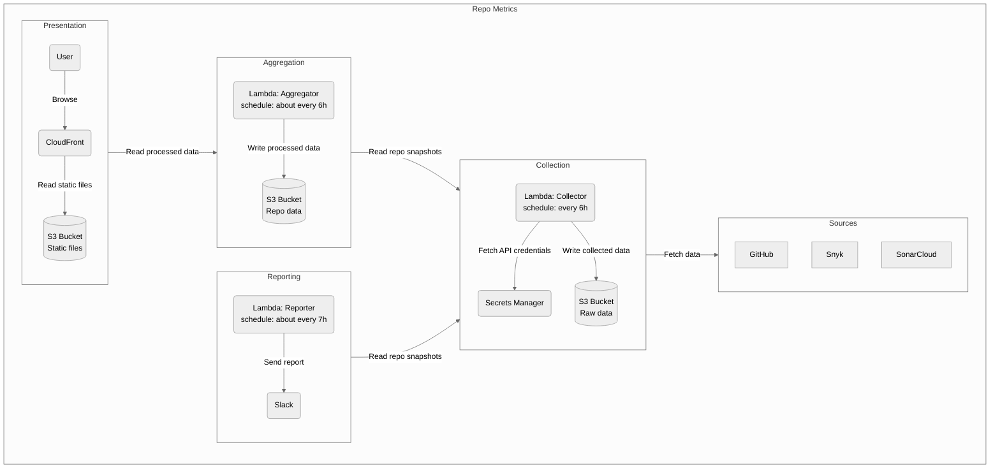

# repo-metrics

Repo Metrics collects, processes and presents various metrics related to GitHub repositories.

- Collection: The collector lambda collects metrics from GitHub and supplementary services like SonarCloud and Snyk, and stores them in a file, `snapshot.json`.
- Aggregation: `snapshot.json` is read by the aggregation lambda, its data processed into a format suitable for presentation, and stored in another file, `webapp.json`.
- Reporting: `snapshot.json` is read by the reporter lambda, and the sum of current vulnerabilities is sent to Slack channel `#cals-dev-info`.
- Presentation: `webapp.json` read by the webapp and presented at <https://d2799m9v6pw1zy.cloudfront.net/>.

Instance URL: <https://d2799m9v6pw1zy.cloudfront.net/>

Documentation: <https://liflig.atlassian.net/l/cp/rhke7t35>

## Overview



## Build

Build all packages:

```bash
make
# or
make build
```

Build specific packages:

```bash
make types
make lambdas
make webapp
make infra
```

## Run

To run repo-metrics locally, we must provide a data file to the webapp. This file is located in `packages/repo-collector/data/webapp.json`, and may be produced using either of the two approaches outlined below.

### 1. Collect local data

#### Alternative 1: Collect and aggregate data from live services (GitHub, ..)

This approach downloads data from remote sources to the local file system, then processes it into a webapp friendly format.

Requires `cals-cli` to be configured with tokens for SonarCloud, Snyk and GitHub.

1. Collect data: `make collect-locally`
2. Aggregate data: `make aggregate-locally`

#### Alternative 2: Download existing data from S3

This approach downloads unprocessed (snapshot files) and processed (webapp friendly) data from S3 to the local file system.

Requires: Active shell session using administrative privileges in the liflig-incubator account, e.g. `aws-vault exec liflig-incubator-admin`.

### 2. Serve data and run webapp

After data has been collected and aggregated into `packages/repo-collector/data/webapp.json`, we serve it to the webapp. Do this in two separate windows/panes, as data must be served while the webserver runs.

1. Serve local data: `make serve-local-data`
2. Start webserver: `make start-webserver`

Open local server at: <http://localhost:3000>

## API Key setup

[cals-cli](https://github.com/capralifecycle/cals-cli) is used to do the remote calls
and also controls how keys are set up.

API Keys must be set for:

- GitHub
- Snyk
- SonarCloud

## Deployment

This repo is built and deployed automatically on pushes to master.

## Manually updating repo-metrics

Two lambdas have to be invoked to run a manual update of the live instance of repo-metrics:

Run these using AWS Vault and the `liflig-incubator-admin` role.

- Collector: `make collect-remotely`
- Aggregator: `make aggregate-remotely`

## Contributing

This project accepts contributions. To get started, please contact the maintainers at [Slack](https://liflig.slack.com/archives/C02T4KTPYS2).
