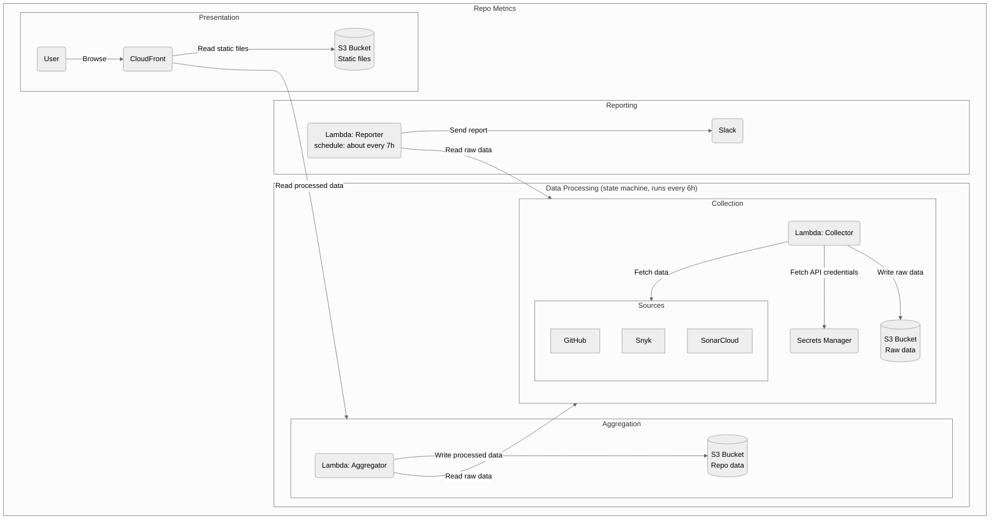

# repo-metrics

Repo Metrics collects, processes and presents various metrics related to GitHub repositories.

- Collection: The collector lambda collects metrics from GitHub and supplementary services like SonarCloud and Snyk, and stores them in a file, `snapshot.json`.
- Aggregation: `snapshot.json` is read by the aggregation lambda, its data processed into a format suitable for presentation, and stored in another file, `webapp.json`.
- Reporting: `snapshot.json` is read by the reporter lambda, and the sum of current vulnerabilities is sent to Slack channel `#cals-dev-info`.
- Presentation: `webapp.json` read by the webapp and presented at <https://d2799m9v6pw1zy.cloudfront.net/>.

Instance URL: <https://d2799m9v6pw1zy.cloudfront.net/>

Documentation: <https://liflig.atlassian.net/l/cp/rhke7t35>

## Overview


```mermaid
%%{init: {'theme':'neutral'}}%%
graph TB
subgraph Repo Metrics

  subgraph Sources
    GitHub
    Snyk
    SonarCloud
  end

  subgraph "Data Processing (state machine, runs every 6h)"
    subgraph Collection
      collector(Lambda: Collector)
      secrets(Secrets Manager)
      raw_data[(S3 Bucket</br>Raw data)]
      collector -- Fetch API credentials --> secrets
      collector -- Fetch data --> Sources
      collector -- Write raw data --> raw_data
    end

    subgraph Aggregation
      aggregator(Lambda: Aggregator)
      processed_data[(S3 Bucket</br>Repo data)]
      aggregator -- Write processed data --> processed_data
    end
  end

  subgraph Reporting
    report(Lambda: Reporter</br>schedule: about every 7h)
    chat(Slack)
    report -- Send report --> chat
  end

  subgraph Presentation
    cf(CloudFront)
    static_files[(S3 Bucket</br>Static files)]
    user(User)
    cf -- Read static files --> static_files
    user -- Browse --> cf
  end

  aggregator -- Read raw data --> Collection
  report -- Read raw data --> Collection
  cf -- Read processed data --> Aggregation

end
```

## Build

Build all packages:

```bash
task
# or
task build
```

Build specific packages:

```bash
task types.build
task lambdas.build
task webapp.build
task infra.build
```

## Run

To run repo-metrics locally, we must provide a data file to the webapp. This file is located in `packages/repo-collector/data/webapp.json`, and may be produced using either of the two approaches outlined below.

### 1. Collect local data

#### Alternative 1: Collect and aggregate data from live services (GitHub, ..)

This approach downloads data from remote sources to the local file system, then processes it into a webapp friendly format.

Requires:

- Active AWS credentials for `liflig-incubator` (used to fetch the GitHub App credentials from Secrets Manager — see [API Key setup](#api-key-setup)).
- Environment variables `SNYK_TOKEN` and `SONARCLOUD_TOKEN`.

```shell
$ task update-local-data
```

#### Alternative 2: Download existing data from S3

This approach downloads unprocessed (snapshot files) and processed (webapp friendly) data from S3 to the local file system.

Requires: Active shell session using administrative privileges in the liflig-incubator account, e.g. `aws-vault exec liflig-incubator-admin`.

```shell
$ task download-s3-data
```

### 2. Serve data and run webapp

After data has been collected and aggregated into `packages/repo-collector/data/webapp.json`, we serve it to the webapp. Do this in two separate windows/panes, as data must be served while the webserver runs.

1. Serve local data: `task serve-local-data`
2. Start webserver: `task start-webserver`

Open local server at: <http://localhost:3000>

## API Key setup

### GitHub — GitHub App installation

GitHub authentication uses a GitHub App (server-to-server auth with installation tokens), not a personal access token. The App is registered in the `capralifecycle` org and installed on the repos it should read.

Credentials live in two AWS Secrets Manager secrets (region `eu-west-1`, account `liflig-incubator`):

- `/incub/repo-metrics/github-app` — JSON `{ appId, privateKey }` — the App identity, shared across all installations.
- `/incub/repo-metrics/github-app-install-capralifecycle` — plain string containing the installation ID for the `capralifecycle` org.

The Lambda reads these at runtime via its IAM role. Locally, the collector reads them via your AWS profile — no PAT or env var is involved for GitHub.

To populate the two secrets for the first time (or to update any non-PEM field), run:

```shell
cd packages/infrastructure
bun load-secrets.ts
```

The PEM is handled separately — see [Rotating the GitHub App private key](#rotating-the-github-app-private-key) below.

### Snyk & SonarCloud — environment variables

Set the following in `.envrc`:

- `SNYK_TOKEN`
- `SONARCLOUD_TOKEN`

## Rotating the GitHub App private key

The App's private key is a long-lived credential that can mint tokens for every installation of the App. GitHub supports up to two active private keys per App, so rotation is zero-downtime. To rotate the private key on suspected compromise:

1. **Generate a new key on GitHub.**
   GitHub → `capralifecycle` org → Settings → Developer Settings → `Liflig Repo Metrics` → "Private keys" → "Generate a private key" (downloads a `.pem`).
2. **Upload it to Secrets Manager.**
   From the repo root, with AWS credentials for `liflig-incubator`:
   ```shell
   task rotate-github-app-pem PEM=./downloaded-key.pem
   ```
   This reads the existing secret JSON, replaces only the `privateKey` field, and writes it back to Secrets Manager
3. **Verify.**
   Redeploy (or wait for the next scheduled collector run) and check CloudWatch logs for the `[github-auth] using GitHub App installation (appId=…, installationId=…)` line and a successful snapshot write.
4. **Revoke the old key.**
   Back in the App's "Private keys" settings, delete the old key.
5. **Delete the local PEM.**
   `rm downloaded-key.pem`

The App ID and installation IDs do **not** need to be rotated — they only change if you re-register the App or if an org uninstalls and reinstalls it.

## Deployment

This repo is built and deployed automatically on pushes to master.

## Manually updating repo-metrics

The lambdas used for updating data are orchestrated by an AWS Step Function state machine. This state machine runs a schedule, but we can trigger it manually to refresh existing data.

Run the below command using AWS Vault and the `liflig-incubator-admin` role.

```shell
$ task update-remote-data
```

## Architecture Decision Records (ADR)

Architecture Decision Records in this project are stored in the `./doc/adr` directory.

Refer to the [first ADR](doc/adr/0001-record-architecture-decisions.md) for more information.

## Contributing

This project accepts contributions. To get started, please contact the maintainers at [Slack](https://liflig.slack.com/archives/C02T4KTPYS2).
